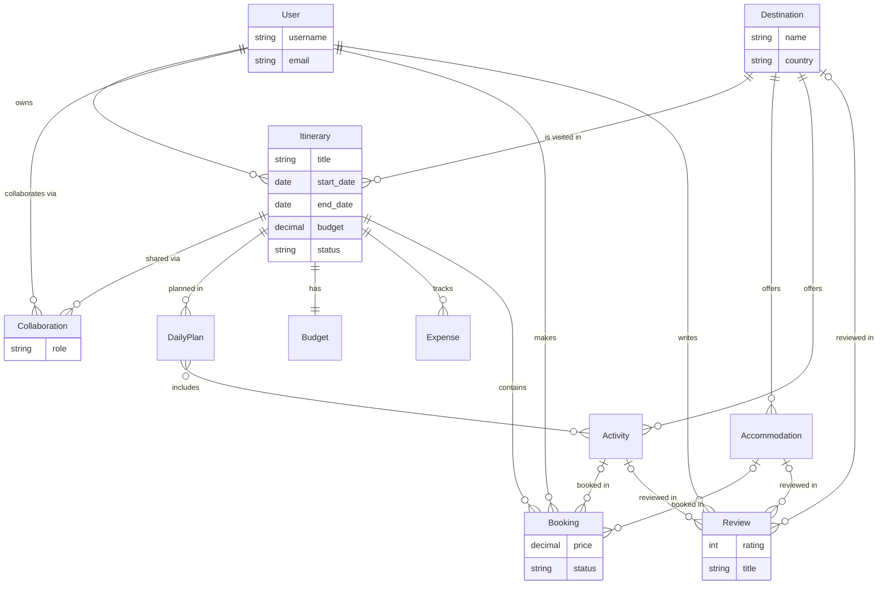

# Entity Relationship Diagram

Notes:

- Collaboration is the through model for the many-to-many between User and Itinerary (`Itinerary.collaborators`).
- A Booking points to either an Accommodation or an Activity, and a Review points to exactly one of Destination, Accommodation, or Activity (enforced in each model's `clean()`), so those links are optional.
